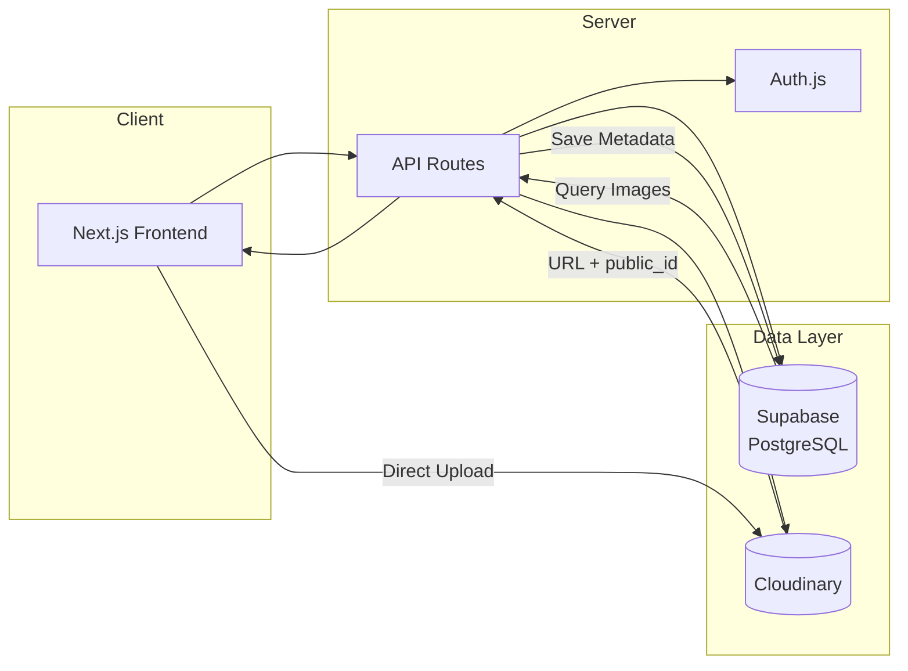
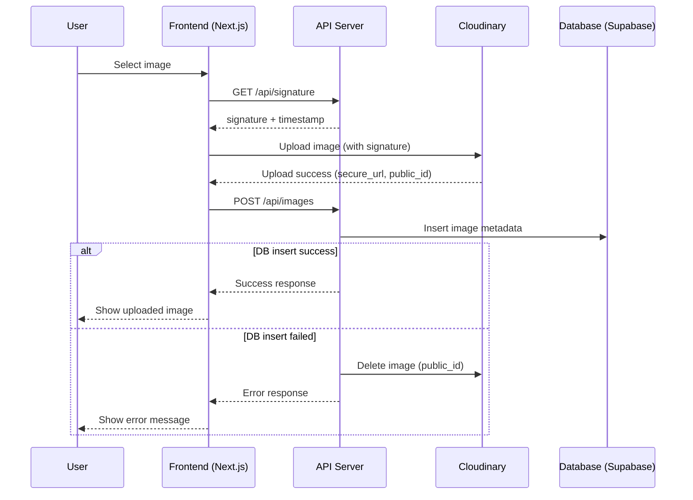
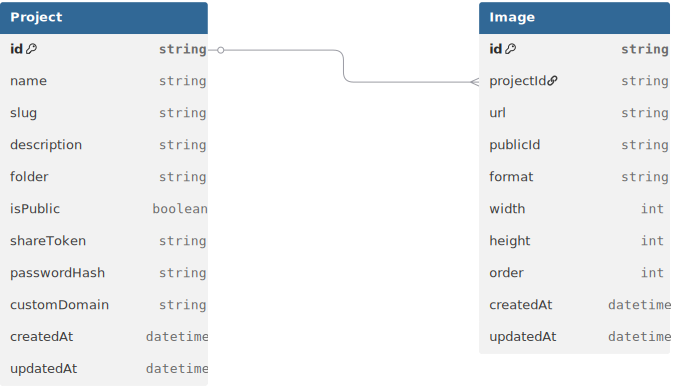

# PicShare

👋 **Read more details about Project Design and Development here [Devleopment-Notes](./Development-Notes.md)**

## How to run the project

Run `npm install`, then `npm run dev`.

## Setup Prisma database (first time only)

This project uses Prisma with PostgreSQL.

Set `DATABASE_URL` in `.env.local`, then run `pnpm prisma migrate dev`.

## View database

Run `npx prisma studio`

## 💡 Objective

A lightweight photo sharing and collaborative selection platform.

PicShare is a personal project exploring a focused scenario:

-Take dozens of photos →
Share them via link →
Let others browse in a visually refined way →
Select favorites →
Download selected results.

Not a cloud drive.
Not a social network.
A focused photo sharing and collaborative selection platform.

## 🏗️ System Architecture

## 📤 Upload Flow (Signed Upload + DB Sync)

### Upload Strategy

- Images are uploaded directly from the frontend to Cloudinary using a signed upload.
- After a successful upload, metadata is stored in the database.
- If the database operation fails, the uploaded image is deleted from Cloudinary to maintain consistency.

## Database Schema

## Overview

- A **Project** represents a collection of images
- Each **Image** belongs to a single Project (1:N relationship)
- Image files are stored externally (e.g. Cloudinary), while the database stores metadata only

## Access Patterns

- Public access: `/[slug]`
- Private sharing: `/share/[token]`

## Key Fields

- `slug`
  URL-friendly identifier for public routes

- `shareToken`
  Unique token used for private sharing links

- `isPublic`
  Controls whether a project is accessible publicly

- `publicId`
  External storage identifier (used for deletion and transformations)

- `folder`
  Logical storage path, decoupled from any specific provider

- `projectId`
  Foreign key linking Image to Project

- `order`
  Optional priority for manual sorting (fallback: `createdAt`)

## Notes

- Deleting a Project cascades to its Images in the database
- External storage (e.g. Cloudinary) must be cleaned up separately
- Sorting strategy:
  - First by `order` (if set)
  - Then by `createdAt` (default fallback)

## Core Design

### Project Focus

PicShare explores the design and architecture of a structured photo sharing workflow.

The emphasis is on:
- Display abstraction
- Collaborative state modeling
- Storage decoupling
- Deployable architecture

### Display First

Photos are presented through modular gallery layouts:

- Grid / Waterfall / Masonry
- Slide / Viewer

The display layer is isolated from:

- Database implementation
- Storage provider
- Authentication logic

It should be portable and reusable.

### Structured Selection

The system models active selection, not passive viewing:
- Mark / favorite
- Rating (planned)
- Shared visibility of selections

### Image Strategy

Clear separation between:

- Preview (web-optimized)
- Original (full resolution)

Design considerations include:

- Performance
- Bandwidth

Replaceable storage providers

## 🚀 Development Phases

### Phase 1 – MVP

- Focus on core sharing loop.
- Upload photos
- Web-optimized preview
- Grid / waterfall / slide view
- Share link (public / password)
- Download
- Mobile save to photos
- Basic invited user login

### Phase 2 – Collaboration

- Roles (admin / user / guest)
- Mark / rate
- Selection visualization
- Filtering

### Phase 3 – Structural Expansion

- Album system
- Project grouping
- Selection export
- Better mobile UX
- Docker-based self-hosted deployment

(These directions are exploratory and may not be implemented.)

##  Use Cases

PicShare aims to support two core use cases:

1. Everyday Sharing

Upload a batch of photos
Generate a shareable link

Allow fast browsing on mobile or desktop
Enable selection and download

2. Photographer + Client Workflow

Upload full shooting session
Client marks / rates preferred photos
Shared visibility of selections
Export selected results

The display layer is designed to also function as:
- A personal portfolio gallery
- reusable photo presentation engine

3. Possible Enterprise Directions (Future Consideration)

- Multi-stakeholder collaboration
- Selection consensus visualization
- Version management (retouched variants)
- Approval workflow
- Activity logs

